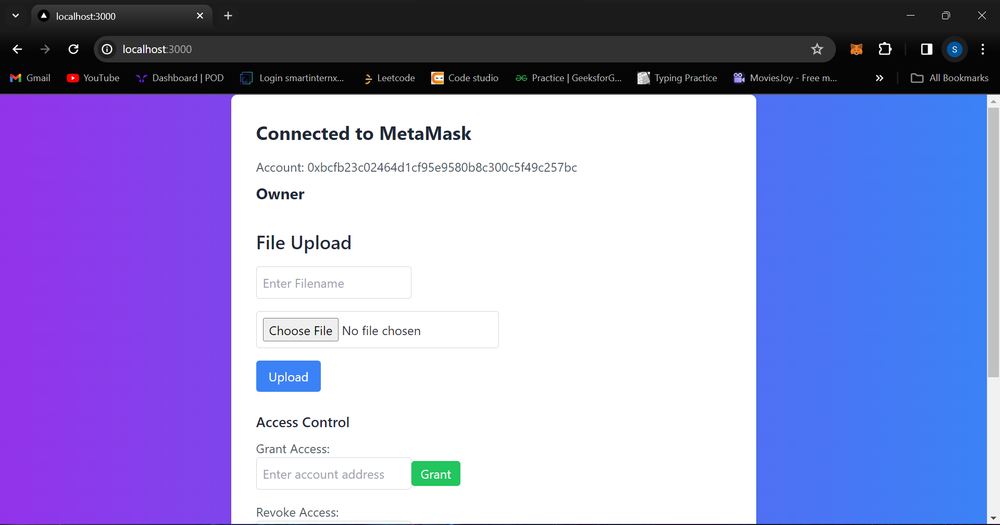
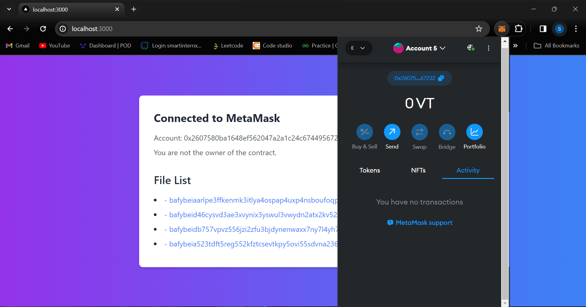

# Blockchain-based Document Storage

## About
This project focuses on decentralized document storage, leveraging blockchain technology for enhanced security and reliability. It utilizes IPFS (InterPlanetary File System) for file storage and smart contracts to store document hash values, ensuring integrity and immutability.

## Features
- Built with a blockchain-based architecture for decentralized document storage.
- Utilizes IPFS for efficient and secure file storage.
- Smart contracts are employed to store document hash values, ensuring data integrity.
- Incorporates the Next.js framework for seamless user interface development.
- Utilizes Ether.js for smooth interaction with smart contracts.

## How to Use
1. Clone the repository.
2. Install dependencies using `npm install`.
3. Start the application using `npm run dev`.
4. Access the application through your web browser.
5. Begin uploading and storing documents securely on the blockchain.

## Technologies Used
- Blockchain
- IPFS (InterPlanetary File System)
- Smart Contracts
- Next.js
- Ether.js

## Contributors
- [Shriniket Kulkarni](https://github.com/Shriniket007)

## License
This project is licensed under the [MIT License](LICENSE).
